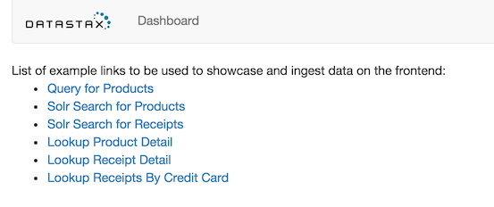
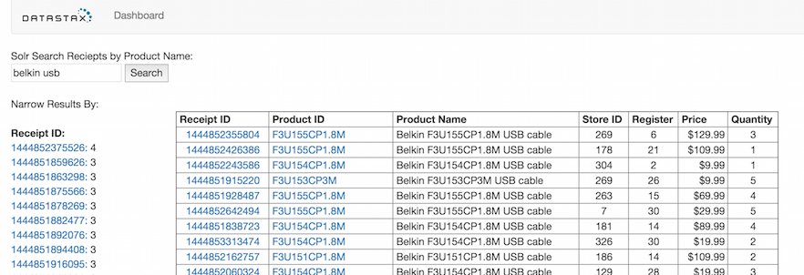
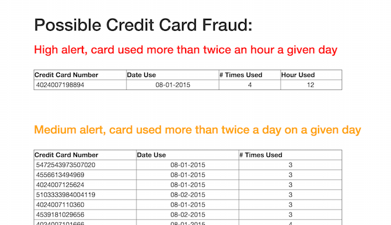

# Capstone project - Bootcamp8 (Team America - Kunal, Nate and Matt)

## Goals:
1. Extend/Modify the data model to add Customer information to receipts.
2. Determine top 10 customers at each store (by dollar amount).
3. Search receipts by product description, customer info.
4. Detect fraud cases. (use of same card in different state within 24 hours)

### 1. Modify data model to include Customer information to receipts.
The first thing was decide on how we wanted to capture the data.  We decided to use a User Define Type, just for the challange of it, though we coudl have easily just extended the various tables.  They key here when using is where we wanted to use statics as a data model, and where it did not make sense.

```
CREATE TYPE retail.cust_addr (
        first_name text,
        last_name text,
        addr1 text,
        city text,
        state text,
        zip text
);

ALTER TABLE retail.receipts ADD customer frozen <cust_addr> static;

ALTER TABLE retail.receipts_by_store_date ADD customer frozen <cust_addr>;

ALTER TABLE retail.receipts_by_credit_card ADD customer frozen <cust_addr> static;
```
After that we needed to generate some customer data and we did that with a quick java class

```
ackage com.datastax.bootcamp.capstone.generatedata;

import java.io.FileWriter;
import java.util.Random;

import org.fluttercode.datafactory.impl.DataFactory;

public class NameAddressGenerator {

	public static void main(String[] args) {
		DataFactory df = new DataFactory();
		String[] states = { "AL", "AK", "AZ", "AR", "CA", "CO", "CT", "DE", "FL", "GA", "HI", "ID", "IL", "IN", "IA",
				"KS", "KY", "LA", "ME", "MD", "MA", "MI", "MN", "MS", "MO", "MT", "NE", "NV", "NH", "NJ", "NM", "NY",
				"NC", "ND", "OH", "OK", "OR", "PA", "RI", "SC", "SD", "TN", "TX", "UT", "VT", "VA", "WA", "WV", "WI",
				"WY" };
		try {
			FileWriter writer = new FileWriter("/Users/Matwater/UserData.csv");
			Random rand = new Random();
			for (int i = 0; i < 5000; i++) {

				String firstName = df.getFirstName();
				String lastName = df.getLastName();
				String address = df.getAddress();
				String city = df.getCity();
				String state = states[rand.nextInt(50)];
				String zip = df.getNumberText(5);

				writer.append(firstName);
				writer.append(',');
				writer.append(lastName);
				writer.append(',');
				writer.append(address);
				writer.append(',');
				writer.append(city);
				writer.append(',');
				writer.append(state);
				writer.append(',');
				writer.append(zip);
				writer.append('\n');

			}

			writer.flush();
			writer.close();
		} catch (Exception e) {
			e.printStackTrace();
		}
	}

}

```
This created a simple csv file that had data.  Then we just had to update jmeter to pull from the file and when writing to cassandra include the customer data.  Once we had this we were then able to create reports, etc to acutally use this data.


### 2. Determine Top 10 customers at each store (by dollar amount spent)

#### Initial efforts/approach-  using SparkSQL/Dataframes:

commands below were executed in DSE SPARK shell.

* import org.apache.spark.sql.SaveMode
* import org.apache.spark.sql.types.SQLUserDefinedType
* csc.setKeyspace("retail")

val top_customers_by_store_df = csc.sql("select customer, store_id, SUM(receipt_total) as receipts_total, credit_card_number FROM receipts_by_credit_card GROUP BY store_id, credit_card_number,customer ORDER BY store_id ASC,receipts_total DESC")

(assumption of 1creditcard/customer which we changed in the next approach, since customers can have multiple creditcards)
    
top_customers_by_store_df.write.format("org.apache.spark.sql.cassandra").options(Map("keyspace" -> "retail", "table" -> "top_customers_by_store")).mode(SaveMode.Overwrite).save()

* This sparkSQL approach stalled and was given up after we discovered a bug during Save() operation. -> "Cannot save to UDT rows in C * from UDT's read into Dataframes.". We opened the below DSE SPARK JIRA for this bug.
```
JIRA·Oct-14 1:40 AM
 SPARKC-271: Cannot save to UDT C* Rows from UDT's read into Dataframes In Progress→Send to Reviewing→Reviewing
by Russell Spitzer
Assignee: Russell Spitzer
```

#### Final approach: using regular RDD based ETL operations
Top10CustomersByStore.scala code below:
```
import com.datastax.spark.connector._
import org.apache.spark.{SparkConf, SparkContext}

// Customer struct to retrieve the UDT values from C* row.
case class Cust(
                 first_name: String,
                 last_name: String,
                 zip:String
                 )

object Top10CustomersByStore {

  // Function to create Cust class for Customer UDT
  def udt2Cust(cust:UDTValue) = Cust(cust.getString("first_name"), cust.getString("last_name"), cust.getString("zip"))

  def main(args: Array[String]) {

    //  Create Spark Context
    val conf = new SparkConf(true).setAppName("Top10CustomersByStore")

    //  We set master on the command line for flexibility
    val sc = new SparkContext(conf)

    //  Compute Top 10 Customers By Store
    val storereceipts = sc.cassandraTable("retail","receipts_by_credit_card")

    val storecustomer_totals= storereceipts.map( row =>  ( (row.getInt("store_id"), row.getUDTValue("customer")), row.getDecimal("receipt_total") ) )
        .reduceByKey(_+_)   // Adding up receipt total for key=storeid+customer

        storecustomer_totals.map{ case ((store, cust ), amt) => (store, (amt,cust)) }
        .groupByKey.flatMap{ case (store, custAmtList) => custAmtList.toArray.sortBy( custamt => -custamt._1 ). // Flat map, convert to Array and sort by receipt_total
          take(10).map(ca => (store, ca))}  // Filter sorted flatmap to get 10 records for amount+customer and map to Storeid.

        .map{ case (store,(amt,cust) ) => (store, amt, cust) } //lastly map again to match the columnfamily order in top_customer_by_store table

        .saveToCassandra("retail","top_customers_by_store") // finally save to Cassandra
  }
}
```

To run the program, execute:
* dse spark-submit --class Top10CustomersByStore spark-top10customersbystore-assembly-1.1.jar

## 3. Search receipts by product
### Create a solr core

First had the system create it by running
```
dsetool create_core retail.receipts generateResources=true reindex=true deleteAll=true 
```
then looking at the core create via http://localhost:8983/solr/#/~cores and pull down the schema and tweak.
Main tweak was making sure the product_id field was not split like a text field, but instead was a string. This means the schema ended up being.
```
<?xml version="1.0" encoding="UTF-8" standalone="no"?>
<schema name="autoSolrSchema" version="1.5">
	<types>
		<fieldType class="org.apache.solr.schema.TrieLongField"
			name="TrieLongField" />
		<fieldType class="org.apache.solr.schema.TextField" name="NonParsed" />
		<fieldType class="org.apache.solr.schema.TextField" name="TextField">
			<analyzer>
				<tokenizer class="solr.StandardTokenizerFactory" />
				<filter class="solr.LowerCaseFilterFactory" />
			</analyzer>
		</fieldType>
		<fieldType class="com.datastax.bdp.search.solr.core.types.DecimalStrField"
			name="DecimalStrField" />
		<fieldType class="org.apache.solr.schema.UUIDField" name="UUIDField" />
		<fieldType class="org.apache.solr.schema.TrieIntField" name="TrieIntField" />
	</types>
	<fields>
		<field indexed="true" multiValued="false" name="receipt_id"
			stored="true" type="TrieLongField" />
		<field indexed="true" multiValued="false" name="product_name"
			stored="true" type="TextField" />
		<field indexed="true" multiValued="false" name="product_id"
			stored="true" type="NonParsed" />
		<field indexed="true" multiValued="false" name="unit_price"
			stored="true" type="DecimalStrField" />
		<field indexed="true" multiValued="false" name="scan_id" stored="true"
			type="UUIDField" />
		<field indexed="true" multiValued="false" name="total" stored="true"
			type="DecimalStrField" />
		<field indexed="true" multiValued="false" name="quantity"
			stored="true" type="TrieIntField" />
	</fields>
	<defaultSearchField>product_name</defaultSearchField>
	<uniqueKey>(receipt_id,scan_id)</uniqueKey>
</schema>
```
With the file name being saved as receipts.xml

We then dropped the core so it can be recreated with our tweaks 
```
dsetool unload_core retail.receipts
```
then recreated
```
dsetool create_core retail.receipts schema=receipts.xml solrconfig=solrconfig.xml reindex=true
```
### create web pages
Created using the python builds and templates.  Added link to index page.  




The page allows you to do a solr search on product name against the receipts table.  Data is presented 
```
 Receipt ID	 Product ID	 Product Name	 Store ID	 Register 	 Price 	 Quantity
```



With Receipt ID taking you to the recipet details page, and product id taking you to the product details page.  Facet search on 'Receipt ID' and 'Product ID'.  Becuase of the product id faceting is why we made sure the field was not parsed.


## Results/Lessons/Comments:


## Doing Fraud Detection
For fraud detection started with a couple of basic, simple rules.   If a credit card is used more than once per day, want to send a warning for someone to look into.  If the same credit card is used the same day in the same hour, send a bigger flag.

This is over simplification, what you will want to be able to do long term is to build in custome usage behavior through machine learning to figure out individual limits.  This simple rule is a starting place to show what can be done.

### Table set up
How the tables to capture data

```
CREATE TABLE IF NOT EXISTS retail.credit_card_fraud_alert_by_day (
    credit_card_number bigint,
    usage_date text,
    num_times_used int,
    PRIMARY KEY ((credit_card_number, usage_date), num_times_used)
) WITH CLUSTERING ORDER BY (num_times_used DESC);


CREATE TABLE IF NOT EXISTS retail.credit_card_fraud_alert_by_day_hour (
    credit_card_number bigint,
    usage_date text,
    num_times_used int,
    hour_used text,
    PRIMARY KEY ((credit_card_number, usage_date), num_times_used)
) WITH CLUSTERING ORDER BY (num_times_used DESC);
```

### Scala code
The code to do this is created in a singlce file, FraudDetection.scala.  See code below

```
import com.datastax.spark.connector._
import org.apache.spark._
import java.text.SimpleDateFormat

case class CreditCard(
  creditCard: Long,
  dateTime: Long,
  storeId: Int)

object FraudDetection {
  def main(args: Array[String]) {

    // Create Spark Context
    val conf = new SparkConf(true).setAppName("FraudDetection")

    // We set master on the command line for flexibility
    val sc = new SparkContext(conf)

    // Load the initial Data
    val ccusage = sc.cassandraTable("retail", "receipts_by_credit_card").select("credit_card_number", "receipt_timestamp", "store_id").as(CreditCard)

    // add a column for the date, for the hour, and 1 (to add later if date is the same)
    val ccDateHour = ccusage.map { case CreditCard(creditCard, dateTime, storeId) => (creditCard, dateTime, storeId, new SimpleDateFormat("MM-dd-yyyy").format(dateTime), new SimpleDateFormat("hh").format(dateTime), 1) }

    // reducing by the formatted date time and credit card, sorted by the count desc
    //val ccDateKey2 = ccusage.map{case CreditCard (creditCard, dateTime, storeId) => ((creditCard, new SimpleDateFormat("MM-dd-yyyy").format(dateTime)),1)}.reduceByKey(_+_).sortBy(- _._2)
    val ccDateKey = ccusage.map { case CreditCard(creditCard, dateTime, storeId) => ((creditCard, new SimpleDateFormat("MM-dd-yyyy").format(dateTime)), 1) }.reduceByKey(_ + _).sortBy(-_._2).filter(_._2 > 1)
    ccDateKey.map { case ((x, y), z) => (x, y, z) }.saveToCassandra("retail", "credit_card_fraud_alert_by_day")

    // reducing by formanted date, and hour, sorted by decending count,  red alert if lots in teh same ahoure
    //val ccDateHourKey2 = ccusage.map{case CreditCard (creditCard, dateTime, storeId) => ((creditCard, new SimpleDateFormat("MM-dd-yyyy").format(dateTime), new SimpleDateFormat("hh").format(dateTime)),1)}.reduceByKey(_+_).sortBy(- _._2)
    val ccDateHourKey = ccusage.map { case CreditCard(creditCard, dateTime, storeId) => ((creditCard, new SimpleDateFormat("MM-dd-yyyy").format(dateTime), new SimpleDateFormat("hh").format(dateTime)), 1) }.sortBy(-_._2).reduceByKey(_ + _).filter(_._2 > 1)
    ccDateHourKey.map { case ((a, b, c), d) => (a, b, d, c) }.saveToCassandra("retail", "credit_card_fraud_alert_by_day_hour")
  }
}
```


to execute the job, after you build the project using sbt, just do a 
```
dse spark-submit --class FraudDetection spark-fraud-assembly-1.1.jar
```
### Web Page



Again very basic page.  In a real app there should be a work flow.  Sayign ok, that is normal customer behavior (and still like machine learning to audimate some), or send notice to bank, etc.  Rules have to  be decided on how to display. I orginallys set up for more than 2 and how the job was written.  but with my sample data it was too much to display so did some bad things in the web page select (allow filtering) to get down to a decent sample. 

This is very basic. For a real fraud we would want to do more stouff based on states, on stores (if in 20 states in 20 days, hey may want to look at that, etc).  The main purpose of this is learning how create, bundle and deploy a spark job via scala.
